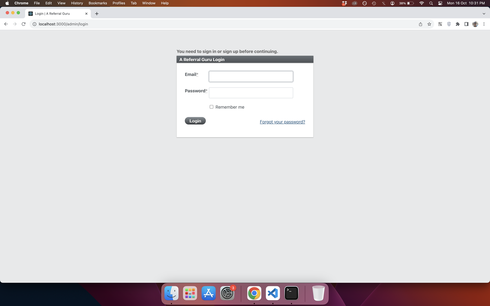
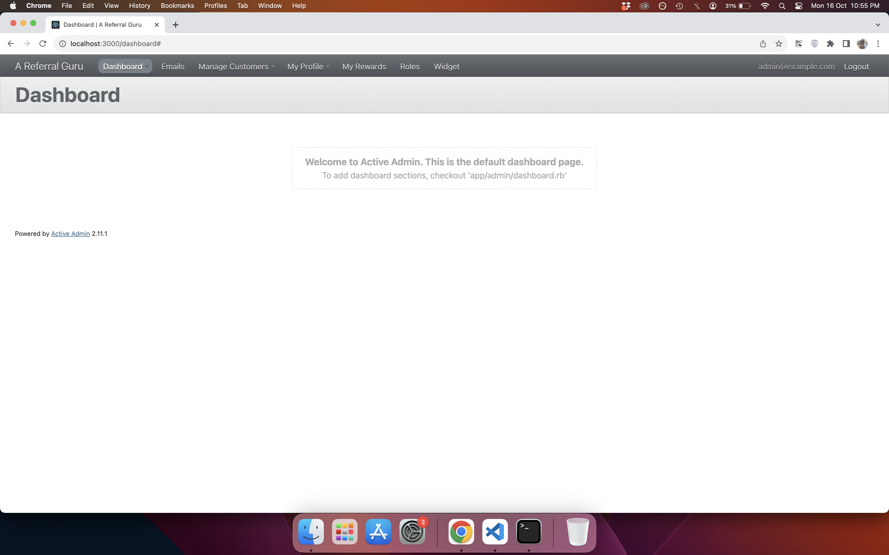
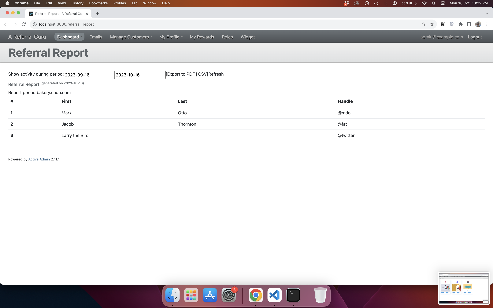
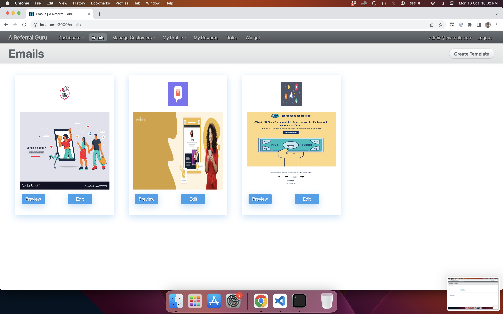
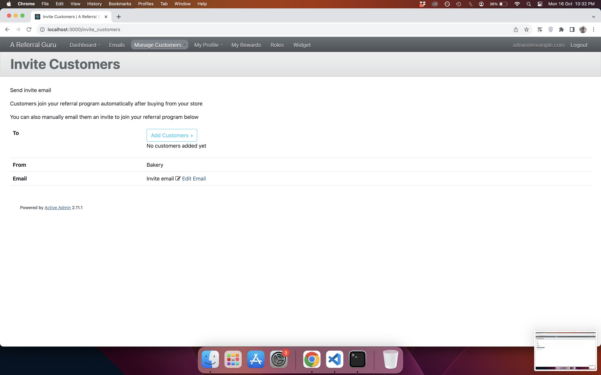
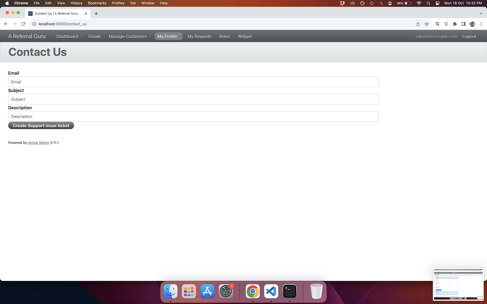
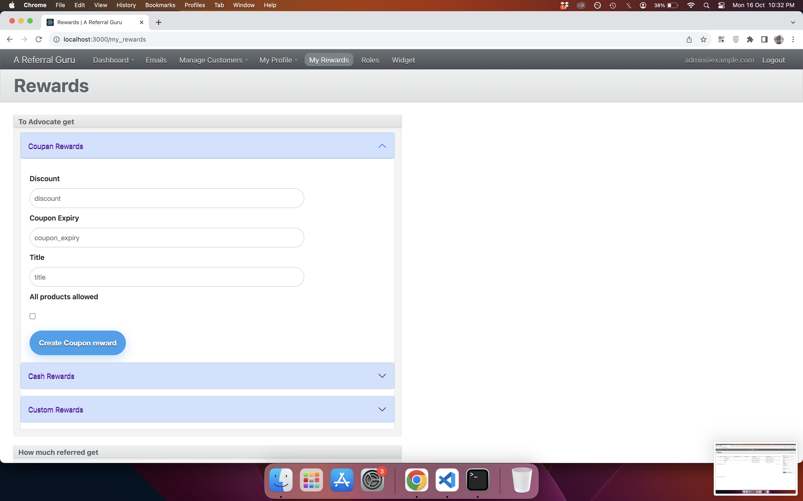
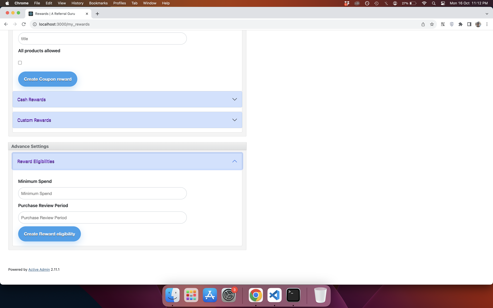
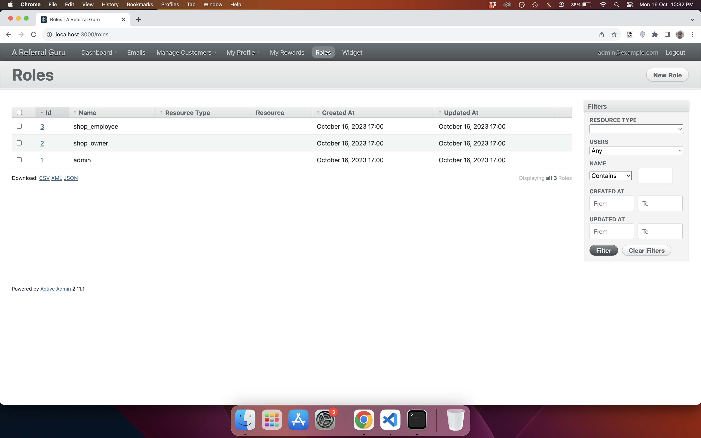
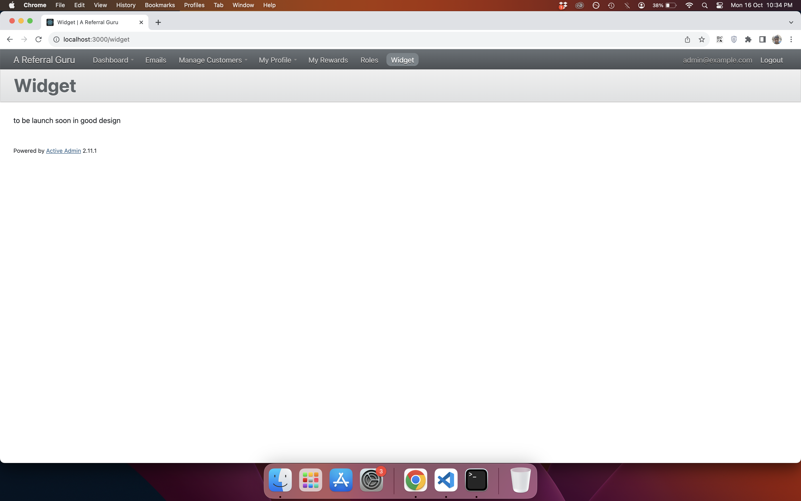

# AreferralGuru
A rails application for business to gets more customers by incentivizing referrals for their business.

## Technologies

* Ruby 3.1.0

* Rails 7.0.2

* PostgreSQL

## Table of contents
* [AreferralGuru](#areferralguru)
* [Technologies](#technologies)
* [Setup System](#setup-system)
* [Setup Database](#setup-database)
* [Features](#features)
* [Other information](#other-information)

## Setup System
To run this project:

```
$ git clone git@github.com:bansalsumit/areferralguru.git
$ cd ./areferralguru
$ rvm install 3.1.0
$ comment the cancancan line in Gemfile
$ bundle install
$ after this gem install rails -v 7.0.2
```

# Setup Database
```
rails db:create
rails db:migrate
rake db:seed
```

## Features
* **Login functionality for: admin, third party client(business), customer**

* **To check App Navigations and what main sections it have visit dashboard page**

* **To check Referral Report by client/business**

* **To add emails template which can shown in your customer email**

* **To Engage customer to referral program Manually**

* **Contact Us page**

* **My Rewards Page**


* **Roles Page**

* **Widgets Page**


## Other information
* Author - Sumit Bansal
* Github - https://github.com/bansalsumit
